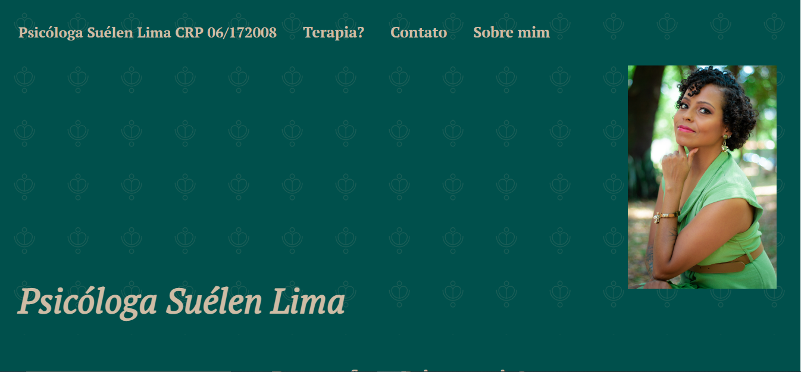

# SITE-PSI

> Resultado do Site de Psicologia.

### Ajustes e melhorias

O projeto ainda está em desenvolvimento e as próximas atualizações serão voltadas nas seguintes tarefas:

- [x] Criação do HTML
- [x] Criação do CSS
- [x] Atualização do Layout
- [ ] Captar os dados dos clientes e enviá los ao destino escolhido

## 🤝 Colaboradora

<table>
  <tr>
    <td align="center">
      <a href="#">
         
        
          <b>Suélen Lima</b>
        
      </a>
    </td>
</table>

[⬆ Voltar ao topo](#SITE-PSI) 